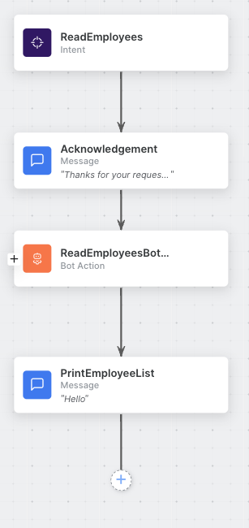

# Kore API Service Node
##### How to make an API call with Service Node

## Watch the example video 
[https://www.loom.com/share/8d7cb5d15230440c88c465891ab07047?sid=b8cf5f54-040f-4d47-8f76-c2e715e9e306](https://www.loom.com/share/8d7cb5d15230440c88c465891ab07047?sid=b8cf5f54-040f-4d47-8f76-c2e715e9e306)

#### Employee List Spreadsheet
In this demo, we will be updating a spreadsheet hosted with apispreadsheets.com

## How to

1. Create a spreadsheet with your preferred data structure. In this demo, we will use an employee list: 
    | ID | First Name | Last Name | Email |
    | -- | ---------- | --------- | ----- |
    | 1	| Peter	| Gibbons	| peter.gibbons@initech.com	|
    | 2	| Michael | Bolton | michael.bolton@initech.com |

2. Upload the spreadsheet to apispreadsheets.com
    - You will receive your APIs URL after uploading 

3. Add API Spreadsheets URL to Environment Variables
    - Configurations > Environment Variables > Add Variable > API_SPREADSHEETS_URL

4. Create Dialog tasks
    - WelcomeTask ( Main entry point )
        - Add Welcome message
        - Add ReadEmployees Dialog Task
    - CreateEmployee
        - Add Employee name entity
        - Add Employee email entity
        - Add CreateEmployeeBotAction
        - Add CreateEmployeeServiceReq Service action in bot actions
        - Add ReadEmployees Dialog Task
        - Scripts in [./js/createEmployee.js](./js/createEmployee.js)
        - 
    - ReadEmployees
        - Add acknowledgement message
        - ReadEmployeesBotAction
        - ReadEmployeesService
        - PrintEmployeeList message
        - Scripts in [./js/readEmployees.js](./js/readEmployees.js)
        - 
    - UpdateEmployee
        - Add EmployeeIDEntity
        - UpdateTypeEntity
        - UpdateValueEntity
        - Add Pre-request Message
        - UpdateUserBotAction
        - SendUpdateUserRequest
        - Transfer to ReadEmployees
        - Scripts in [./js/updateEmployee.js](./js/updateEmployee.js)
        - 
    - DeleteEmployee
        - Add EmployeeID entity
        - DeleteEmployeeBotAction
        - DeleteEmployeeService
        - Transfer to ReadEmployees
        - Scripts in [./js/deleteEmployee.js](./js/deleteEmployee.js)
        - 

