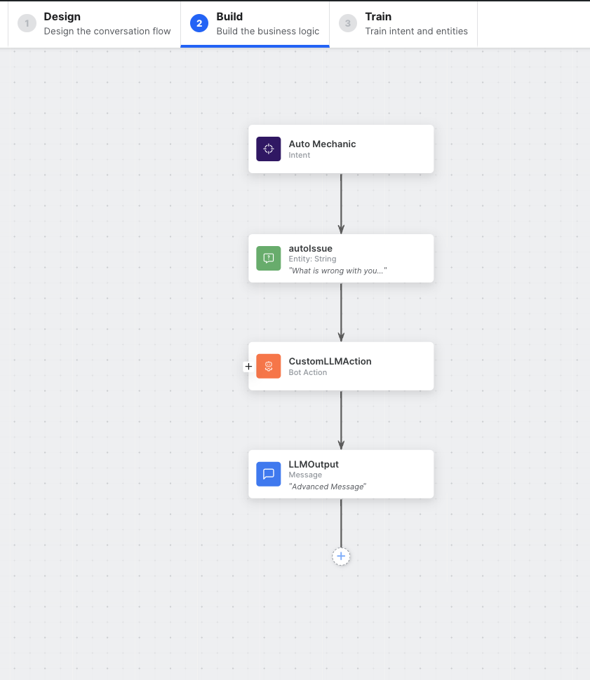

# Custom LLM
Updated June 2024

### How to integrate with a Custom LLM 

## Watch the example video
Custom LLM ( Part 1 ) https://www.loom.com/share/cd03f96671f44dc7a05a5b11655d0043?sid=13de3e6d-1d19-4178-996a-4795a66cf125

### Introduction
In this demonstration, we integrate with Open AI's GPT-3.5-turbo Large Language Model (LLM).

Our application will be a virtual assistant that acts as an auto mechanic helper, who's task is to assist
users to diagnose and troubleshoot their vehicle issues.

## How To

After creating a new bot, we will 
#### Create a new dialog task named auto mechanic 
##### Add an "autoIssue" entity. 
That will serve the content in our API request to Open AI.

##### Then, we will create a new bot action, with a service request. 

In our service request, it will look as follows:   
- Url: `https://platform.openai.com/docs/api-reference/chat`
- Method: `POST`
- Headers: 
    - Content-Type: application/json
    - Authorization: Bearer {{env.OPEN_AI_API_KEY}}
- Body: 
- ```
    {
    "model": "gpt-3.5-turbo",
        "messages": [
          {
            "role": "system",
            "content": "You are a helpful assistant. You are a mechanic who helps people troubleshoot their vehicle problems. You are polite and kind. "
          },
          {
            "role": "user",
            "content": "{{context.entities.autoIssue}}"
          }
        ]
    }
    ```
We can then test our request 

##### Next we will create a message widget with the following message:

In the advanced tab:

```
const response = context.CustomLLMRequest.response;
const data = response.body.choices[0].message.content;
print(data);
```

This will output our LLM integration response to the chat with our user.

##### Next let's train our model

Under train, add utterances like:
- car trouble
- my car has a problem
- I need help with my vehicle
- something is wrong with my truck
- I have an issue with my van

##### Finally test the virtual assistant
Open a chat and give it an issue

##### Debugging
If you run into any issues, you can always add a `koreDebugger.log("message")` and view the logs by pressing the bug icon while in a chat. The logs are also 
available under ANALYZE > TASK EXECUTION LOGS

View of dialog task


