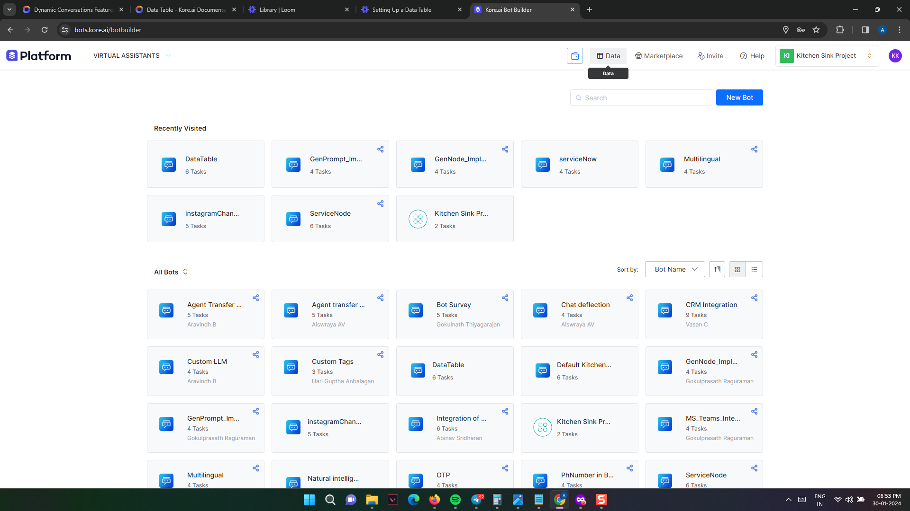
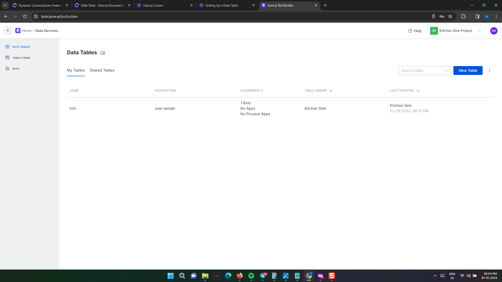
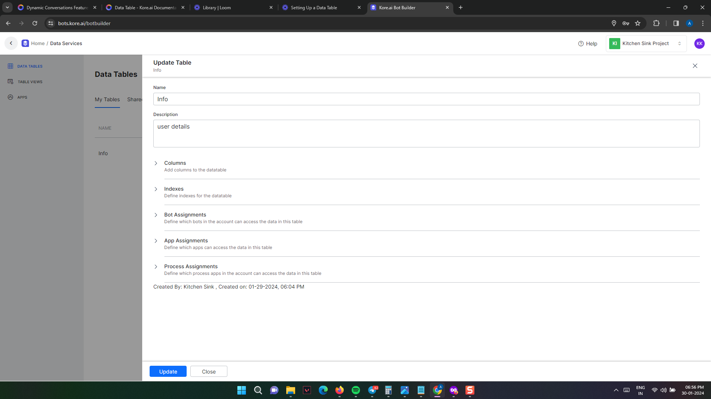
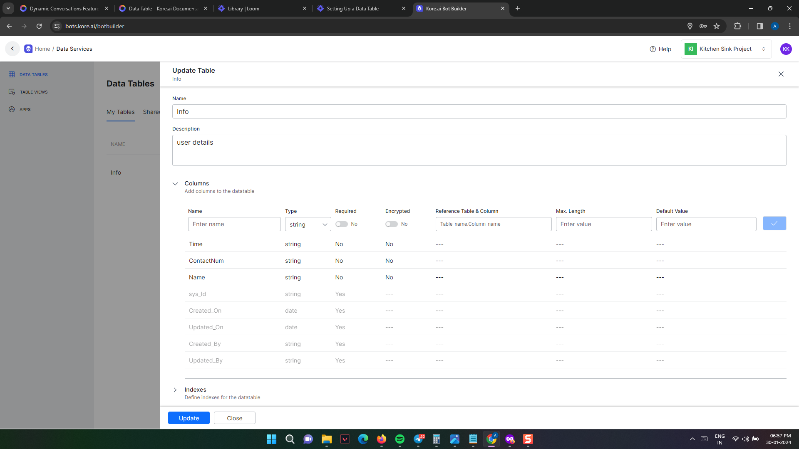
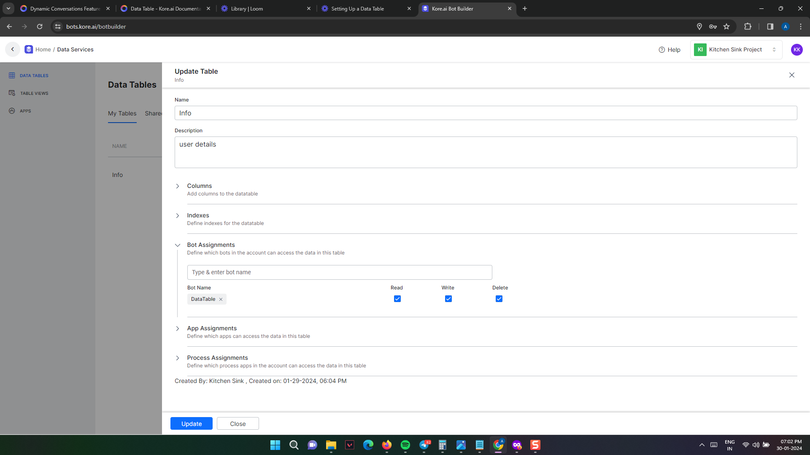
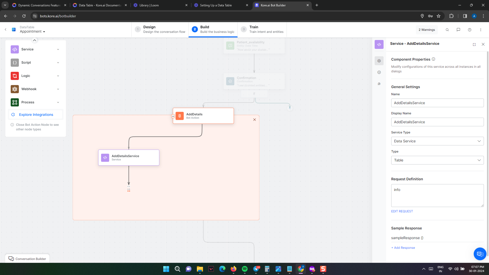
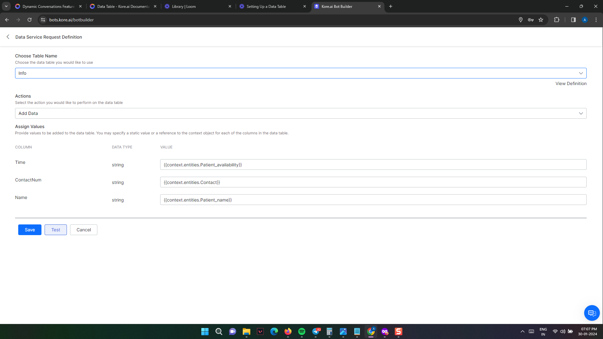
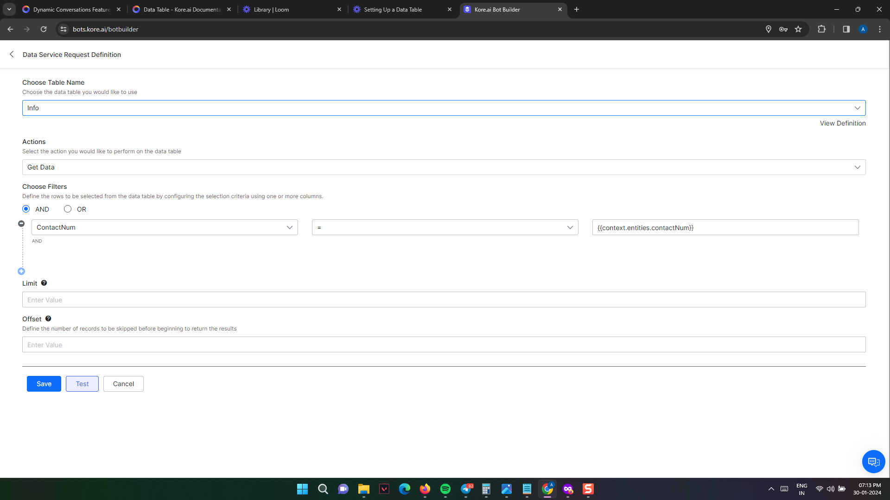

# How to use Data Table

[Last updated: Jun 2024]

##### How to use Data Table in a demo
### Watch the example video
https://www.loom.com/share/0ea01cb1c99340d49d9491bce014976a?sid=b8d5c930-d5c9-4279-ad3d-41fff6d2809f

#### Introduction

This guide explains how to set up and use a Data Table.The instructions for setting up and using the data table are listed below .

##### 1. Create a new table



Go to the Data tab in the Home page and select the Data Tables option and click Create Data Table.

Data > DataTables > Create DataTable



You may have to go to Process Apps to view the Data tab. 

##### 2. Enter the respective details in the Table



    1. Name of the Data Table.
    2. Description of the Data Table.
    3. Columns to be included in the Table.
    4. Indexes for the Table.
    5. Bot Assignments to let virtual assistants access data in this table.
    6. App Assignments to let apps access data in this table.
    7. Process Assignments to let a process app access data in this table

Based on the respective need of the use case the Columns can be specified.



##### 3. Bot Assignments in DataTable  


The respective bot need to be assigned in the “Bot Assignments” field as per the follows,

Here the name of the bot is “DataTable” and the options are selected. 

##### 4. Create a dialog task 


Create a dialog task to get the user input and provide output to the user.

Choose a name for a dialog task related to your Bot. Create an entity node to get user input (Example : For Appointment booking -  get Name,Contact info,Time as an input ).

##### 5. Make a API Call for Adding values to DataTable


Add a bot action that involves creating a service node to perform an API call. In the service node , select the method “Service Type” - “Data Service”.

When making the request, please select the Name of the data table,With respect to action give “Add Data” and then assign the values for the specified columns.

Click Save.

##### 6. Make a API Call for Retrieving values from DataTable



Add a bot action that involves creating a service node to perform an API call. In the service node , select the method “Service Type” - “Data Service”

When making the request, please select the Name of the data table,With respect to action give “Get Data” and then assign the values for the specified columns.

You can also use filters to fetch data from the table. In this case, I've used the contact number to retrieve details about the user from the table.

ContactNum = `{{context.entities.contactnum}}`

Click Save.

This is how you can utilize the data table within the bot. Additionally, you have the capability to perform actions such as updating and deleting data based on the instructions provided above.

##### 7. Display data to the user

Add a message, delete the boiler plate and select *"Advanced"*, paste in the following code:
```
const queryResults = context.GetDetailsService.response.body.queryResult;

let elements = [];

if(queryResults.length === 0){
    return print("Sorry, we don't have any appointments listed");
}

let index = 1;
for(const el of queryResults){
        const value = {
            Values: [index.toString(), el.Name, el.ContactNum, el.Time]
        }
        elements.push(value);
        index++;
}

var message = {
  "type": "template",
  "payload": {
     "template_type": "table",
     "text":"Appointment details",
     "columns":[
        ["Sl","center"],["Name"],["Contact"],["Time"]
      ],
     "table_design": "regular",
     "elements": elements,
     speech_hint:"Here is your appointment details"
    }
}
print(JSON.stringify(message))

```
