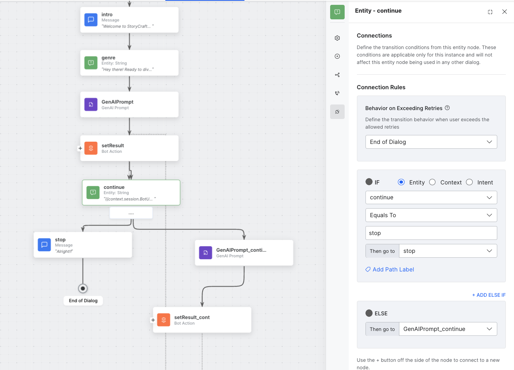
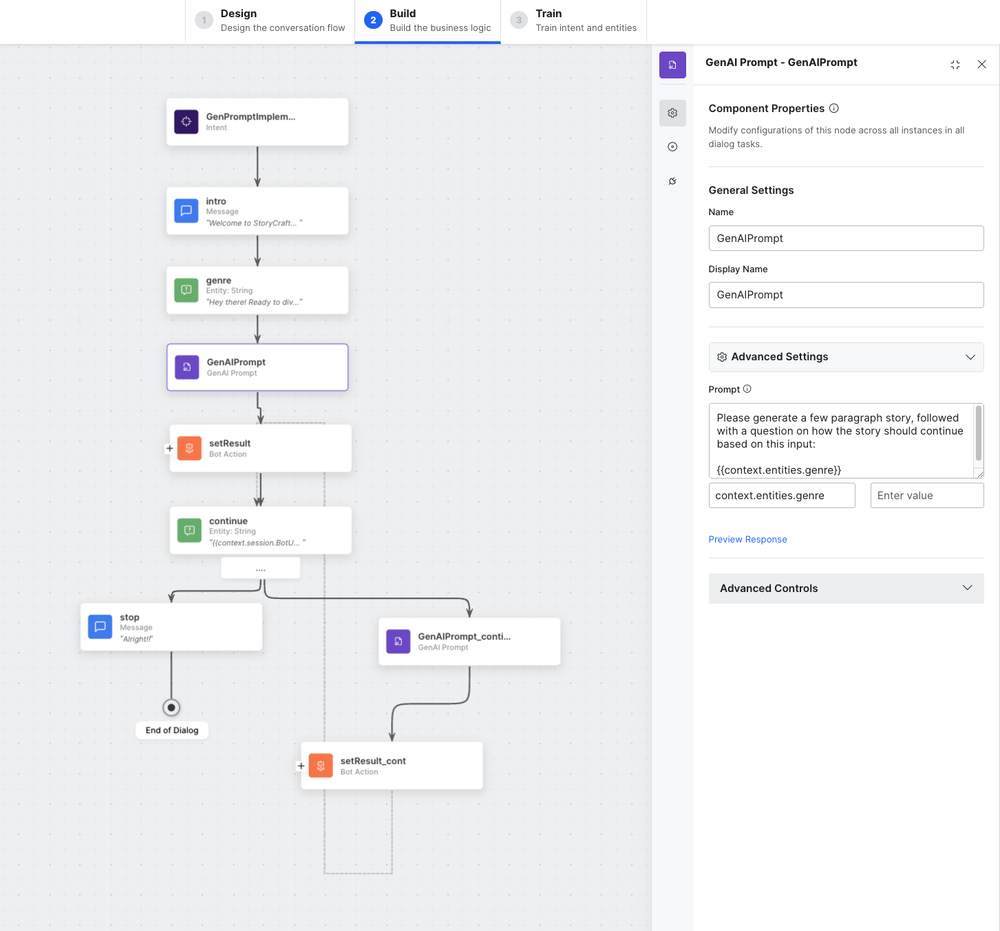

# Kore Gen AI Prompt Implementation

### How to set up and use GEN AI

#### Watch the example video 
[https://www.loom.com/share/879c7a947f854a1fbe0964e3644f0ad4](https://www.loom.com/share/879c7a947f854a1fbe0964e3644f0ad4)

## Prompt Node for Dialog Flow

How to set up and use Gen AI Prompt node for a dialog flow


#### Introduction:
 
The GenAI Prompt lets bot developers leverage the full potential of LLM and Generative AI models to quickly build their own prompts. 
Developers can select a specific AI model, tweak its settings, and preview the response for the prompt. 
The node allows developers to creatively leverage LLMs by defining the prompt using conversation context and the response from the LLMs in defining the subsequent conversation flow.


#### 1. Create a Separate Dialog Task:

Begin by creating a dedicated dialog task in your bot specifically for Gen AI Prompt Node. Name it and choose a custom name that aligns with your project.

#### 2. Integrating Open AI key:
 
Navigate to the  natural language processing section..Within the natural language settings, find the section specifically related to generative AI &LLM.Look for a field or option to enter the OpenAI key. 
It might be labeled as "API Key," .Enter the provided OpenAI API key in the designated field..Enable all relevant features related to OpenAI or generative capabilities. 
After entering the OpenAI key and configuring the desired settings, make sure to save your changes. There might be a "Save" or "Apply" button to confirm the configuration.

#### 3. Gen AI Prompt node :

Drag the Gen AI Prompt node to the dialog  flow and start configuring it.


#### 4. Gen AI Prompt node Configuration:

Let us consider an use case as “interactive story telling bot”.Name the Gen AI Prompt Node intent with relevant topic name and configure Prompt, model, system context and other parameters.

#### 5. Prompt:

A prompt allows you to define the request to be sent to the LLMs for generating a response. It can be defined using text, Context, Content, and Environment variables. 
An example prompt: 
> Please generate a few paragraph story, followed with a question on how the story should continue based on this input: 
{{context.entities.genre}}

#### 6. System Context: 
It's also important to tailor the prompt with the system context, an example could be: 
> You are an interactive storytelling bot. Please only generate a few paragraphs, ending with a question to the user, asking how the story should proceed.

#### 7. Preview Response:

Check the preview of the LLM’s response for your prompt. When you click Preview Response, the Platform parses any variable used in the prompt and constructs LLM:s request using the Prompt and the Advanced Settings. 
If the response is not relevant, you can tweak the Prompt and the Advanced Settings to make the response better.

#### 8. Accessing response:

You can directly access the response of an GenAI Prompt node by using :

`context.GenerativeAINode.GenAi-prompt-node-name.text`

Set the response variable:

`context.session.BotUserSession.response = context.GenerativeAINode.GenAIPrompt.text;`

#### 9. Continue Generation:

Add continue entity with `{{context.session.BotUserSession.response}}` as the prompt. 

Add logic in the connection rules to route to a stop dialog flow, and a continue generating flow.



Add a new prompt with same system context as above, but with the prompt being something like: 
> This is your previous prompt {{context.session.BotUserSession.response}}
this is user's new input {{context.entities.continue}}
continue based on this.

#### 10. Add a bot action: 

Create a bot action with a script node with the following script:
```
context.entities.continue = null;
context.session.BotUserSession.response = context.GenerativeAINode.GenAIPrompt_continue.text;
```

First we set the continue entity to null, the reason being, if it has a value, the bot will not prompt the user, but simply continue along.

Next we set the output variable to the new gen AI text.

#### 11. Train the bot:

Add some utterances to train with like 
- tell me a story 
- help me write a story
- can you tell me a story
- ...etc

click train after adding utterances

#### 11. Run the dialog task: 

Run the dialog task using 'GenPromptImplementation' and check whether all GenAI Prompt nodes work properly, generating the desired output. If not, try changing the system context and prompt.


