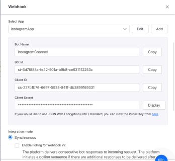
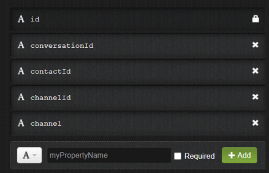
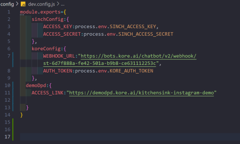
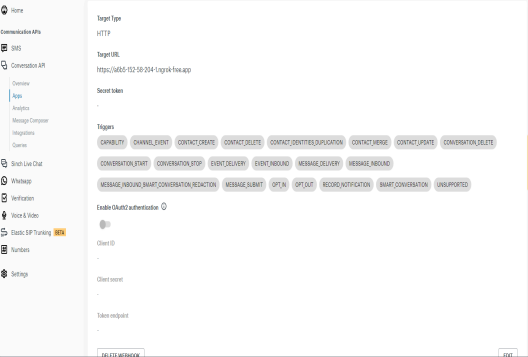
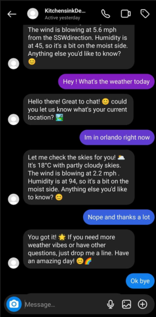
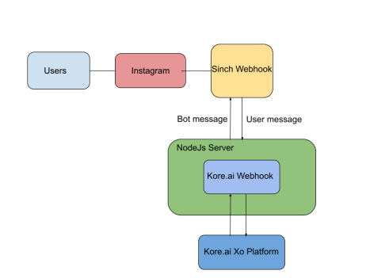

# Instagram Integration

#### How to integrate your bot with Instagram

[Last updated: Jun 2024]

### Watch the example video
https://www.loom.com/share/ba9f0115b9a74078b66a6269f1746df6?sid=fa870f13-c11c-405c-ad2c-61231d12c6bb

## Introduction 

This guide outlines the steps to Integrate kore.ai chatbot with instagram as a channel. As an overview we just developed a NodeJs server utilizing Sinch with Kore Webhook for Instagram channel integration. We have created a server that receives messages from the targeted Instagram channel and sends those messages to the kore.ai platform using Kore webhook. After receiving a response, it is sent back to the Instagram target channel using sinch api. Follow the below steps to Integrate the chatbot with instagram. 

#### 1. Add a webhook 
Begin by creating a dialog task in your bot and design the conversational flow.After that go to Deploy > Channels > Webhook and specify webhook configuration in a Synchronous mode. Finally Publish the bot. 



#### 2. Generate JWT token 
Visit this website https://jwt.io/ and use the client Id and client secret from the webhook configuration page to generate Jwt Token in the following format.
```
{ 
    "sub": "1234567890", 
    "appId": "add-Client-ID-here" 
} 
```

In the Verify Signature field, replace your-256-bit-secret with the Client Secret 

#### 3. Setup Sinch configuration for Instagram 
- Sign up for the Sinch Customer Dashboard. 
- Get access to the Conversation API. 
- Create your app. 
- Create your access key and access secret. 
- Select Instagram in the Set up channels section. 
- Log in with your Facebook credentials and complete the integration process Reference Link: 
    1) https://developers.sinch.com/docs/conversation/channel-support/instagram/set-up 
    2) https://dashboard.sinch.com 

#### 4. Setup DEPLOYD collection: 
Go to the DEPLOYD dashboard and create a new collection with the below mentioned fields with its properties.



#### 5. Configure Node js Server: 
- Download the zip file of the node js code from this link and install the essential packages ● Go to \config\dev.config.js.in node js code 
- Add access key and access secret. From sinch dashboard 
- Add Kore.ai wehookV2 url and previously generate JWT token 
- Add DEPLOYD- DB access link 
- Finally run the command “node server.js” and get ngrok link for this server



#### 6. Setup sinch webhook 
Go to the sinch dashboard page and add the ngrok link to the sinch webhook.Configure the necessary triggers for the webhook and hit the save button. 



Reference Link: 

https://developers.sinch.com/docs/conversation/callbacks/#webhook-triggers 

https://community.sinch.com/t5/Instagram/Troubleshooting-the-integration-between-your-Instagram-business/ta-p/9197 

#### 7. Start chatting with bot in the Instagram channel
Finally chatbot is integrated successfully with instagram. Go to the chatbot integrated instagram account and start chatting with the bot.



### Architecture Diagram: 

