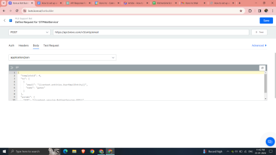
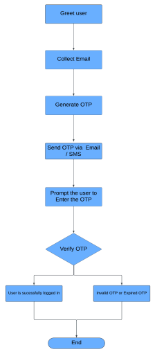

# OTP Generation 
Updated June 2024

### How to set up and use OTP for a dialog flow

## Watch the example video
https://www.loom.com/share/d92ac42a4dfb4a2fad4d891255309240?sid=f1cef099-a661-4f01-a09b-c6b140f963ad

 **Introduction**

 This guide outlines the steps to implement One-Time Password (OTP)
 authentication in your dialogue flow. The OTP will be sent to the user
 via email using the SendGrid API. Follow these steps to enhance the
 security of your system and provide a seamless user authentication
 experience.

 **1. Create a Separate Dialog Task**

 Begin by creating a dedicated dialog task in your bot specifically for
 OTP authentication. Name it \"OTP Authentication\" or choose a custom
 name that aligns with your project.

 **2. Choose the Channel for OTP Delivery**

 Select the channel through which the OTP will be delivered to the
 user. In this guide, we will use email as the delivery channel.

 **3. Greet the User and Collect Email**

Initiate the conversation by greeting the user and prompting them to
provide their email address. You can retrieve the email through user
context or allow manual entry using entities.

 **4. Generate OTP with Timestamp**

 Write JavaScript code to generate a random OTP with a required
 interval of the timestamp. This ensures a unique and time-sensitive
 OTP for each authentication attempt.

 Example :
```
function generateOTP() {
     const otp = Math.floor(1000 + Math.random() \* 9000);
     return otp;
 }

context.session.BotUserSession.OTP = generateOTP();

//current Timestamp

const timestamp = new Date().getTime();

const validityTime = 5 \* 60 \* 1000;

// Calculate the expiration time by adding validityTime to the
timestamp

const expirationTime = timestamp + validityTime;

context.session.BotUserSession.ExpiryTime = expirationTime;
```
**5. Send OTP via Email (Using SendGrid)**

Integrate the SendGrid API to send the generated OTP to the user\'s
email address. Ensure that your implementation securely handles
sensitive information and adheres to best practices for email
delivery.


**6. Prompt User to Enter OTP**

Ask the user to enter the OTP received in their email. This step ensures
user engagement and provides a layer of security.

**7. Verify OTP and Optionally Check Expiry**

Verify if the entered OTP matches the one generated. Optionally, you can
check the timestamp to ensure the OTP hasn\'t expired. Implement
appropriate error handling and messaging for failed verification.

**8. Update User on Authentication Status**

Finally, update the user on the authentication status. If the OTP is
successfully verified, provide access or perform the requested action.
If verification fails, guide the user on the necessary steps or offer
assistance.

**User Diagram** :



