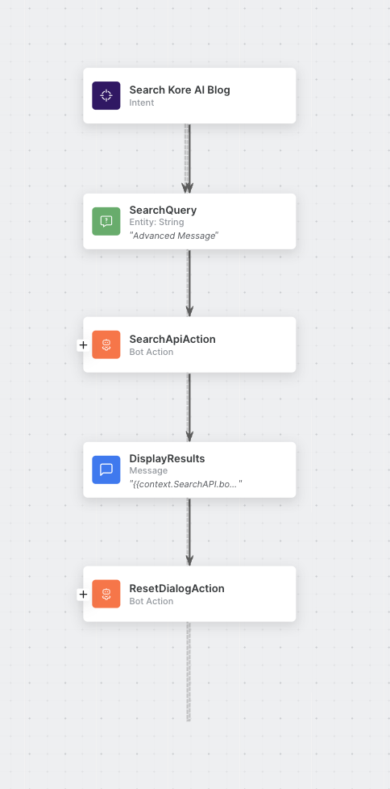

# Kore AI Search Assist ( Search AI XO11 )

#### How to: Integrating Search Assist with the XO platform

### Watch the example video 
[https://www.loom.com/share/a298ceaca9b343ae817ae1fa2f6ff70e?sid=be3c1de1-df70-4595-a290-56c3586e9fff](https://www.loom.com/share/a298ceaca9b343ae817ae1fa2f6ff70e?sid=be3c1de1-df70-4595-a290-56c3586e9fff)

#### Reference Docs
https://docs.kore.ai/searchassist/public-apis/searchassist-apis-list/

https://developer.kore.ai/docs/bots/api-guide/apis/

https://developer.kore.ai/docs/bots/api-guide/apis/#Generating_the_JWT_Token

## Guide

#### Create new SearchAssist App
[https://searchassist.kore.ai](https://searchassist.kore.ai)

In this guide, we will be creating the Kore AI blog bot, which can help you find relevant info from the Kore AI blog.

#### Add new sources
Under the Sources > Web Crawl tab, add new web crawl sources, we will be populating our assistant from here [https://blog.kore.ai/page/1](https://blog.kore.ai/page/1)

#### Manage credentials

Under Manage > Credentials > Add Credential

Give it a name like "Search Assist bot".

Add live search, full search and advanced search in the API scopes

#### Configure Channel

Select Web/Mobile 

In App details, make sure the "Search Assist Bot" credential that was just created is selected.

Select save, now our channel is configured.

#### Create a new Virtual Assistant Bot

- Create a new bot
- Add new Dialog task
- Train dialog
- Add search query entity
    - ```
        let message = '';
        if(context.session.UserSession.isRepeat){
            message = "Would you like to perform another query? If so "; 
        }
        message += "Please enter a search query for the Kore AI blog";
        print(message); ```
- Create a JWT
    - Visit [https://developer.kore.ai/tools/jwt/](https://developer.kore.ai/tools/jwt/)
    - Under Payload: {"appId":"***your-search-assist-client-id-here***"}
    - Verify signature, add your search assist client secret
    - Copy JWT
- Add Search API Action
    - Add Search API Service Request
    - Method: POST
    - URL: https://searchassist.kore.ai/searchassistapi/external/stream/***your-app-id-here***/livesearch
    - Headers
        - Content-Type: application/json
        - auth: ***Your JWT Here***
    - Body 
        ```
        {
            "query":"{{context.entities.SearchQuery}}",
            "maxNumOfResults":3
        }```
- Display Results Message
    - Bot responses > All `{{context.SearchAPI.body.template.results.web.data[0].page_title}}
{{context.SearchAPI.body.template.results.web.data[0].page_url}}`
    - Bot responses > Web/mobile: This lists the results in a nice format, and also filters based on confidence score of results.
        - ```
            const results = context.SearchAPIReq.response.body.template.results.web.data;
            koreDebugger.log(results);

            var message = {
                "type": "template",
                "payload": {
                    "template_type": "list",
                    "elements": [],
                    "buttons": [
                        {
                            "title": "View More",
                            "type": "postback",
                            "payload": "payload"
                        }
                    ]
                }
            };
            for (i = 0; i < results.length; i++) {
                if(results[i].score < 10){
                    continue;
                }
            //if element doesn't need to have buttons
                var element = { //
                    "title": results[i].page_title,
                    "image_url": results[i].page_image_url,
                    "subtitle": results[i].page_preview,
                    "default_action": {
                        "type": "web_url",
                        "url": results[i].page_url,
                        "messenger_extensions": true,
                        "webview_height_ratio": "tall",
                        "fallback_url": "fallback url"
                    }
                };
                /*

                 /* Uncomment this if the element is having buttons
                 var element =  { //
                 "title": info[i],
                 "image_url": "image url of the element",
                 "subtitle": "Description of the element",
                 "default_action": {
                 "type": "web_url",
                 "url": "Url to redirect when user clicks on the element",
                 "messenger_extensions": true,
                 "webview_height_ratio": "tall",
                 "fallback_url": "fallback url"
                 },
                 buttons:[
                 {
                 "title": "button1",
                 "type": "web_url",
                 "url": "url to redirect",
                 "messenger_extensions": true,
                 "webview_height_ratio": "tall",
                 "fallback_url": "fallback url"
                 }
                 ]
                 } */
                message.payload.elements.push(element);
            }
            print(JSON.stringify(message));

- Reset Dialog Action
    - Reset Dialog Script
        - ```
            context.entities.SearchQuery = null;
            context.session.UserSession.isRepeat = true;
            ```
    - Connect Action back to Search Query Entity

- Resulting Dialog Task


