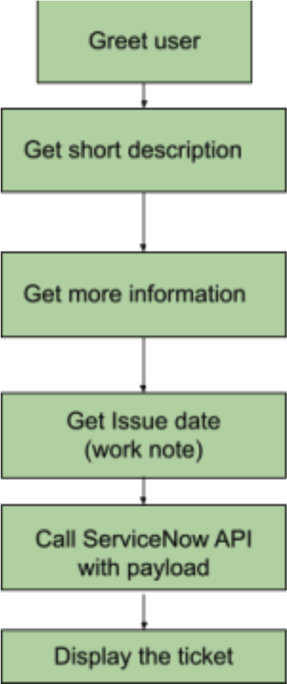

# Kore Service Now Integration

#### How to set up ServiceNow integration and get a ticket

### Watch the example video 
[https://www.loom.com/share/40238575dc5745bca1f965c4f2fe3b81](https://www.loom.com/share/40238575dc5745bca1f965c4f2fe3b81)

## Introduction 
This guide outlines the steps to Integrate set up ServiceNow and get a ticket. Follow these steps to Integrate the ServiceNow and kore.ai chatbot together. 
1. Create a Separate Dialog Task 
Begin by creating a dedicated dialog task in your bot specifically for serviceNow integration. Name it "CreateTickets" or choose a custom name that aligns with your project. 
2. Get the short description of ticket 
Create a bot action with script node and add this code `context.shortDescription= context.session.BotUserSession.lastMessage.messagePayload.message.body` to get a short description as the user’s last utterance. You can also use entities to collect the short description explicitly from the user. 
3. Get description and issue date: 
Create two entities in the same dialog task to get more information about the ticket and also to get the exact issue date from the user. 
4. Create a service node with Service now API: 
- Create a bot action with a service node which should be configured to make a REST API.
- Define API URL with POST method request. Example: 
`https://{{SNOW_TENANT_SUBDOMAIN}}.service-now.com/api/now/table/incident`
- In the headers section set Content-Type as “application/json” and Authorization as “Basic YOUR_AUTH_TOKEN” 
- In the Body Section add all your payload in the below given json format. 
Example: 
``` 
”{ 
"assigned_to": "ENTER_THE_ASSIGNED_USER_ID", 
"u_type": "incident", 
"category": "YOUR_CATEGORY", 
"short_description": "{{context.shortDescription}}", 
"description": "{{context.entities.getDescription}}", 
"caller_id": "YOUR_CALLER_ID", 
"contact_type": "YOUR_CONTACT_TYPE", 
"urgency": "1", 
"impact": "3", 
"work_notes": "{{context.workNote}}" 
} 
” 
```
- Finally click on save button. 

5. Display the ticket 
Create a message node and the below given code in advance message option 
- For web/mobile client: 
    - [displayTicketMessage.js](./js/displayTicketMessage.js) 
- For All Channels: 
```
const createInidentResponse = context.CreateTicketService.response; const setCallerResponse = context.CreateTicketService.response; 

let createStatusCode = createInidentResponse.statusCode * 1; 

let setCallerStatusCode = setCallerResponse.statusCode * 1;

let response = ''; 

if ((createStatusCode >= 200 && createStatusCode <= 299) && (setCallerStatusCode >= 200 && setCallerStatusCode <= 299)) { 
    const responseResult = createInidentResponse.body.result; 
    const url = responseResult.opened_by.link; 
    let url_splitted = url.split('/') 
    let baseURL = `https://${url_splitted[2]}`; 
    const title = responseResult.number; 
    const priority = responseResult.priority; 
    const textInfo = `short Description: ${responseResult.short_description}\nDescription: ${responseResult.description}`; 
    const URL = 
    `${baseURL}/sp?sys_id=${responseResult.sys_id}&view=sp&id=ticket&table=incident`; 
    let plainText = `Incident created\n\n${title}\nPriority: ${priority}\n${textInfo}\nURL: ${URL}\n\n`; 
    response = plainText 
} else 
    response = `Error ${(createStatusCode >= 200 && createStatusCode <= 299) ? setCallerStatusCode : 
    createStatusCode}.\n${createInidentResponse.body?.error?.message || 
    setCallerResponse.body?.error?.message}` 
    print(response); 
```
6. Run The dialog task 
Add the user utterance and train it well. Finally run the dialog to create the Service now ticket

User Diagram :


