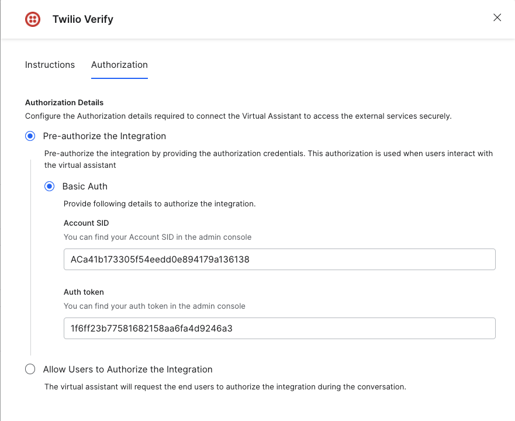
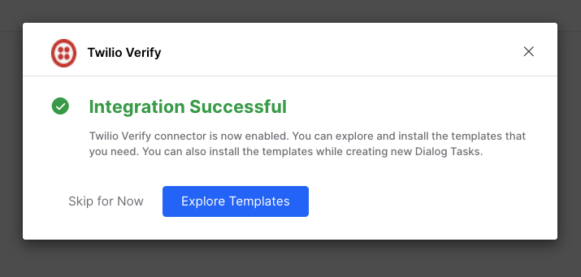
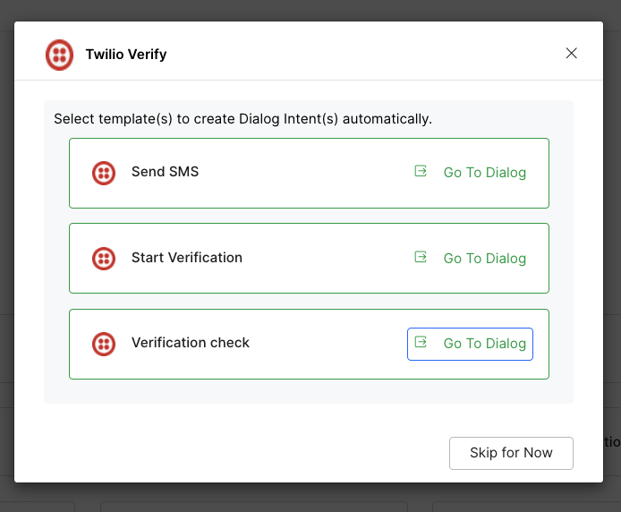
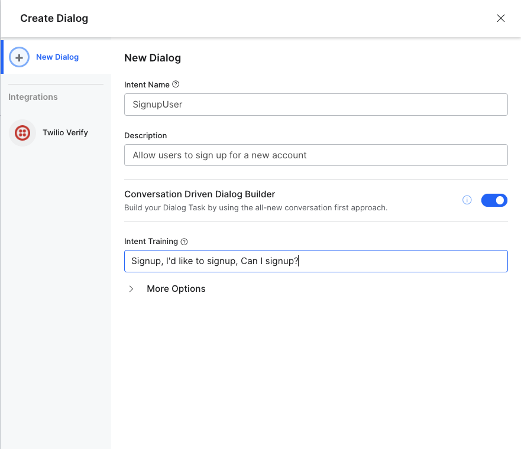
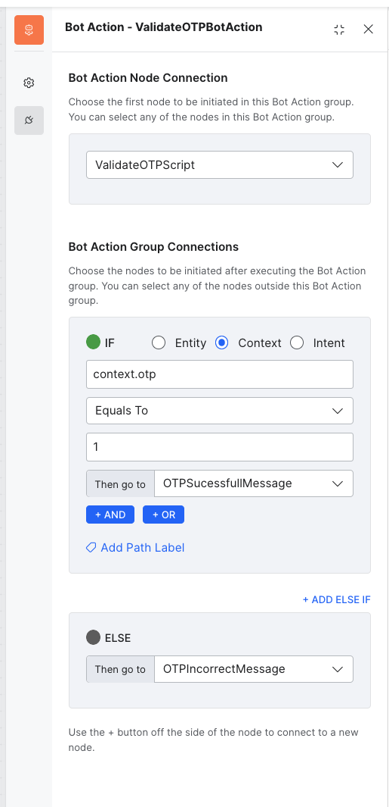
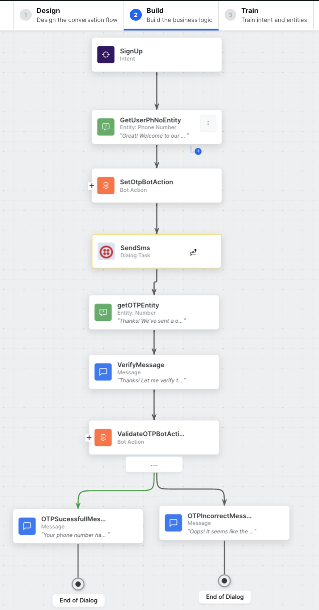
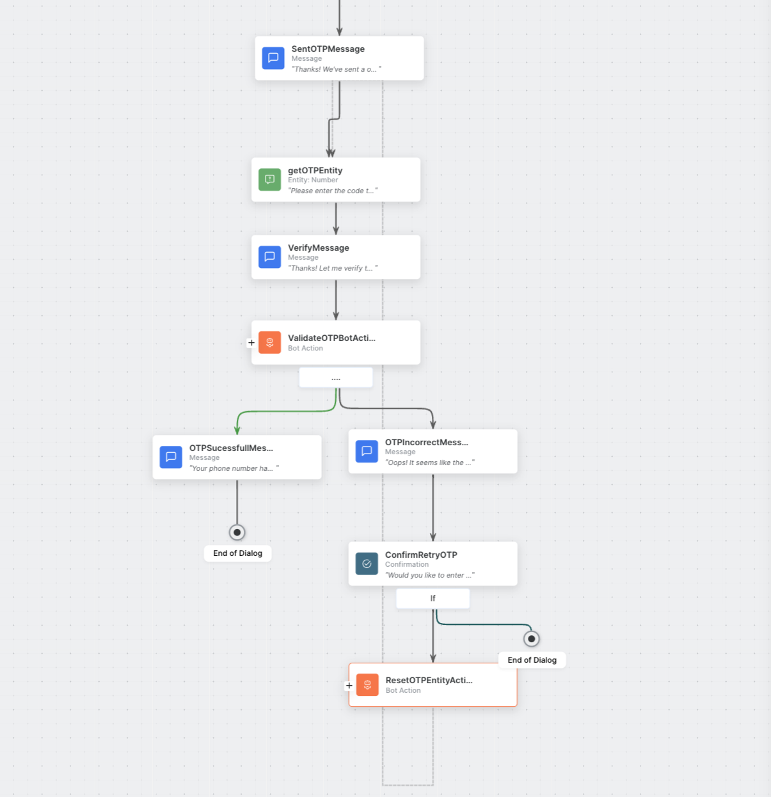

# How to send SMS using Twilio

[Last updated: May 2024]

### Watch the example video 
[https://www.loom.com/share/358bcaa393b74d15af1f1115d8b6aece?sid=2c619d9e-facd-4342-aa3b-2ca98bae1886](https://www.loom.com/share/358bcaa393b74d15af1f1115d8b6aece?sid=2c619d9e-facd-4342-aa3b-2ca98bae1886)

## Introduction
This guide outlines the steps to send SMS using Twilio. Connect your Twilio Instance with the
Kore.ai XO Platform to power your conversations to send sms, start verification perform other
actions. Follow these steps to Integrate the send SMS using Twilio .
1. Enable the Twilio Verify Action :
    - Go to Build > Integrations > Actions
    - Once you click the Actions menu, all integrations are shown in the Available region.
Select the Twilio Verify action.
    - Select the Pre-authorize the Integration option, and then select the Basic Auth option.
    - Enter the Account SID and Auth Token .
    - Click Enable. When you configure the action for the first time, the Integration Successful
pop-up is displayed.




2. Create Send SMS Dialogue
    - Click install on the templates provided

    - A new dialog task was created. 
    - Go to Dialog Tasks -> SendSms

3. Set Environment Variables
    - Go to configurations > Environment Variables
    - Add Variable
    - Add TWILIO_ACCOUNT_SID
    - Add TWILIO_FROM_NUMBER

4. Create Signup Dialog Task
    - Create Dialog
    - New Dialog 
    - Name it Signup or a custom name that aligns with your project.

    - Select Proceed
    - Add entity to get user phone number
        - Change "Type" to Phone Number
    - Create bot action with script node and add function to generate a random otp
    - code:
        ```
        context.session.BotUserSession.userph = context.entities.GetUserPhNoEntity;
        context.session.BotUserSession.otp = Math.floor(1000 + Math.random() * 9000);
        context.session.BotUserSession.message = `Your OTP is ${context.session.BotUserSession.otp}`;
        context.session.BotContext.twilioAccountSid = env.TWILIO_ACCOUNT_SID;
        context.session.BotContext.twilioFromNumber = env.TWILIO_FROM_NUMBER;
        ```

5. Send Twilio SMS and check OTP
    - Connect previously created “SendSms” dialog task to this flow.which will send OTP sms to the user’s phone number. 
        - Set Instance Properties
        ```
        receiverNumber0001 = context.session.BotUserSession.userph
        accountSid0001 = context.session.BotContext.twilioAccountSid
        Message0001 = context.session.BotUserSession.message
        twilioNumber0001 = context.session.BotContext.twilioFromNumber
        ```
    - Get the received OTP from the user using entity. 
    - Finally validate the generated OTP with the OTP entered by the user
    - Create ValidateOTPBotAction
    - Add validate script
        - ```
            if(context.entities.getOTPEntity == context.session.BotUserSession.otp) {
                context.otp = 1
            }
            else {
                context.otp = 0
            }
            ```
    - Add IF condition to ValidateOTPBotAction
    


## Improvements

6. Conversation repair when wrong OTP is entered
    - Add Confirmation widget: ConfirmRetryOTP
    - If yes, add Bot Action (ResetOTPEntityAction) > New Script > ResetOTP. Else "End of Dialog"
    - Script code: `context.entities.getOTPEntity = undefined;`
    - Set resetEntity script connection to "End of bot action"
    - Create new Message widget: "SentOTPMessage" and break up the Get OTP entity response
    - SentOTPMessage: ***Thanks! We've sent a one-time verification code to your phone number.***
    - GetOTPEntity: ***Please enter the code to continue.***
    - Connect "ResetOTPEntityAction" to "SentOTPMessage"

Updated flow



