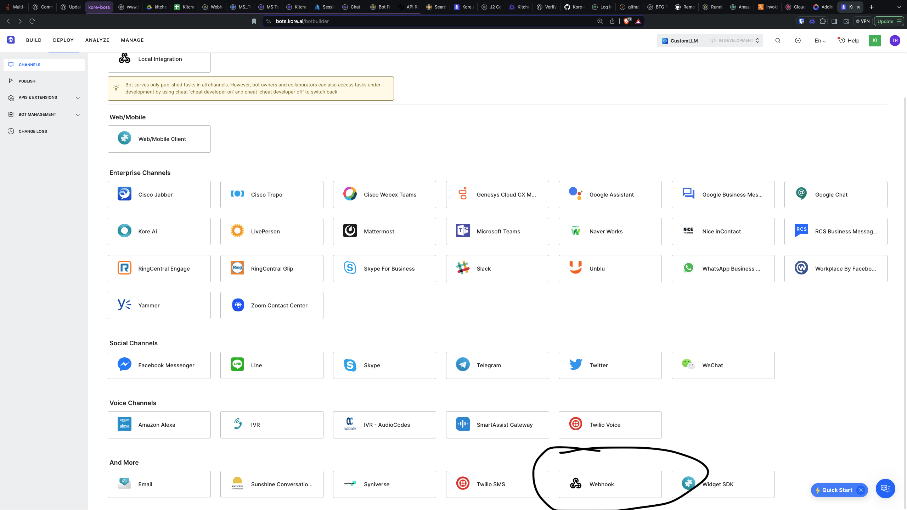
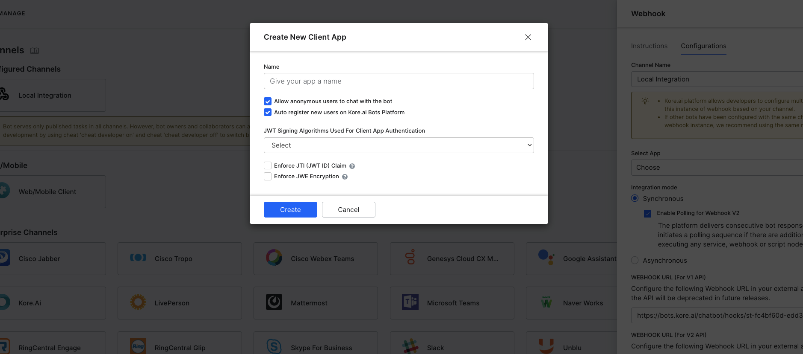
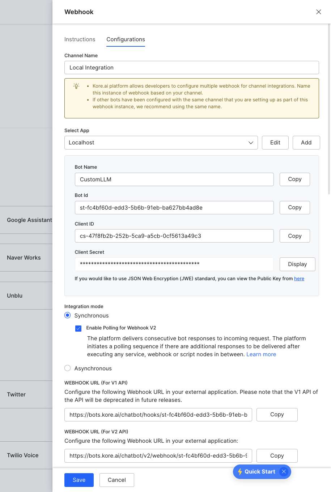

# Add a Webhook as a Channel 
Updated June 2024

### How to Add a Webhook as a Channel

## Watch the example video
https://www.loom.com/share/97e0bc6f38be415386d954db595fbdbd?sid=8f28c63e-d4bb-4be7-9707-37f94150e294

### Introduction
For this example, we use the [CustomLLM bot](../kore-custom-llm), and enable a webhook as a channel.

Once you have a bot, you might want to access it via webhook, so your existing or new applications can interact with the Kore AI bot, using API requests.

## How to

### Enable Channel
After creating our Dialog tasks ( see custom LLM ), we will deploy them normally.

Then, navigate to Deploy > Channels and select Webhook at the bottom of the screen. 


Create a new configuration, which involves creating a new app


The new app should be selected, and you should see your app details



### Integrate Channel

First in the `js` directory: `mv example.env dev.env` and add the following:
```
BOT_ID=st-
APP_ID=cs-
APP_SECRET=
```
Then run `node index.js`. If you'd like to see debug logs, run `node index.js debug`

This application will integrate with your VA via webhook.  
